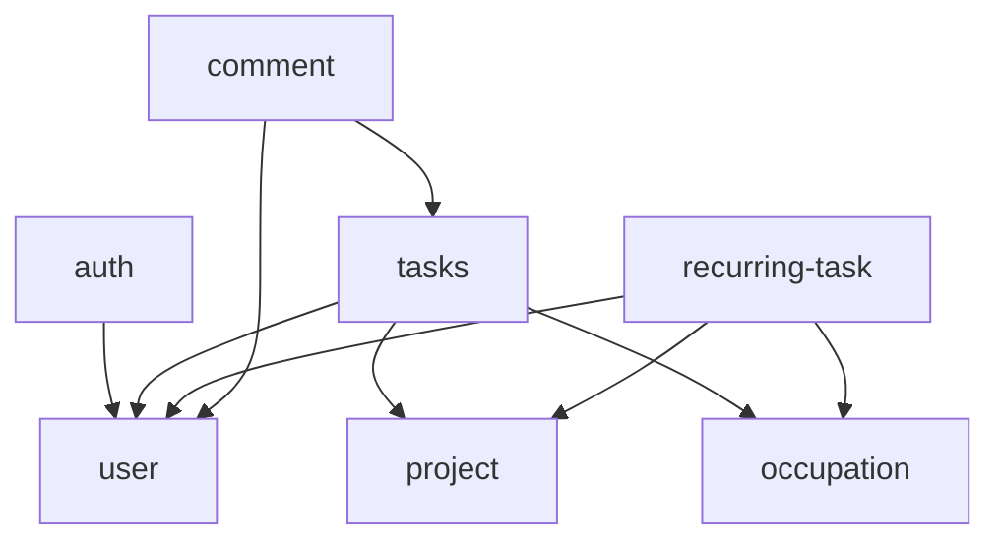

# Modules

Este diretório contém todos os módulos da aplicação, organizados seguindo os princípios SOLID e padrões de projeto estabelecidos no [CLAUDE.md](../../../CLAUDE.md).

## 📁 Estrutura Modular

```
modules/
├── activity-log/     # Log de atividades do sistema
├── auth/            # Autenticação e autorização
├── comment/         # Sistema de comentários
├── occupation/      # Gestão de ocupações/cargos
├── project/         # Gestão de projetos
├── recurring-task/  # Tarefas recorrentes
├── role/           # Sistema de papéis/funções
├── tasks/          # Gestão de tarefas
└── user/           # Gestão de usuários
```

## 🏗️ Arquitetura por Módulo

Cada módulo segue uma estrutura consistente:

```
module-name/
├── controllers/     # Controladores REST API
├── dto/            # Data Transfer Objects
├── entities/       # Entidades TypeORM
├── services/       # Lógica de negócio
├── factories/      # Factory Pattern (quando necessário)
├── strategies/     # Strategy Pattern (quando necessário)
├── enhancers/      # Decorator Pattern (quando necessário)
└── module-name.module.ts
```

## 🎯 Padrões de Projeto Implementados

### Strategy Pattern
- **auth**: Diferentes estratégias de hash de senha
- **tasks**: Diferentes operações de repository
- **recurring-task**: Diferentes estratégias de criação/atualização

### Factory Pattern
- **auth**: Criação de payloads JWT e respostas de autenticação
- **recurring-task**: Criação e atualização de tarefas recorrentes
- **tasks**: Criação de tarefas com validações

### Decorator Pattern
- **recurring-task**: Enhancement de ocupações em templates

### Facade Pattern
- Implementado nos controllers para simplificar chamadas aos services

## 🔧 Princípios SOLID Aplicados

### Single Responsibility Principle (SRP)
- Cada service tem uma responsabilidade específica
- Factories isolam lógica de criação
- Strategies isolam algoritmos específicos

### Open/Closed Principle (OCP)
- Modules extensíveis via Strategy Pattern
- Factory Pattern permite novas estratégias sem modificar código existente
- Decorator Pattern permite adicionar funcionalidades sem alterar classes base

### Interface Segregation Principle (ISP)
- DTOs específicos para cada operação
- Interfaces pequenas e focadas

### Dependency Inversion Principle (DIP)
- Services dependem de abstrações (interfaces)
- Injeção de dependência via NestJS

## 📊 Dependências Entre Módulos



## 🧪 Testing

Cada módulo possui:
- **Unit Tests**: Para services e DTOs
- **Mocks**: Factories mocadas para isolamento de testes
- **Coverage**: 100% de cobertura mantida

## 🚀 Como Adicionar um Novo Módulo

1. **Criar estrutura de diretórios:**
```bash
mkdir src/modules/new-module
mkdir src/modules/new-module/{controllers,dto,entities,services}
```

2. **Implementar seguindo padrões:**
   - Service com responsabilidade única
   - DTOs para validação de entrada
   - Entidade TypeORM
   - Controller RESTful
   - Factory/Strategy se houver múltiplas validações

3. **Adicionar testes:**
   - Service tests
   - DTO validation tests

4. **Registrar no app.module.ts**

## 📋 Convenções

- **Nomes**: kebab-case para diretórios, PascalCase para classes
- **Exports**: Sempre exportar service e module
- **Imports**: Importar apenas o que for necessário
- **Error Handling**: NotFoundException para entidades não encontradas
- **Validation**: Class-validator nos DTOs

## ⚡ Performance

- **Lazy Loading**: Módulos carregados sob demanda
- **Relations**: Carregamento otimizado de relacionamentos
- **Query Optimization**: Queries específicas por necessidade

## 🔒 Segurança

- **Guards**: JWT Auth Guard implementado
- **Validation**: Validação rigorosa de entrada
- **Authorization**: Controle de acesso por roles (quando aplicável)